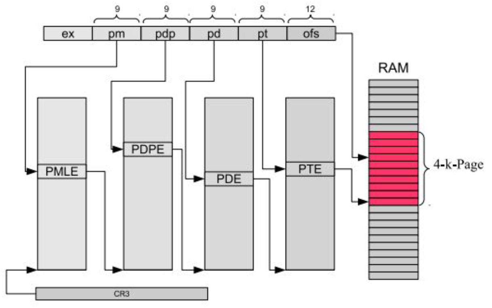
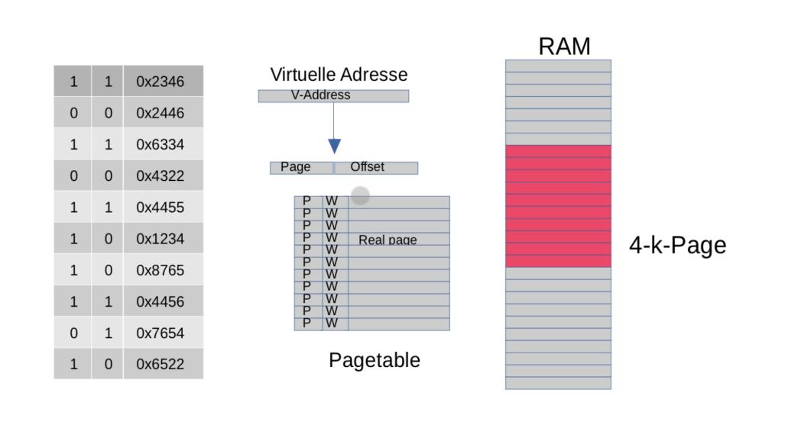
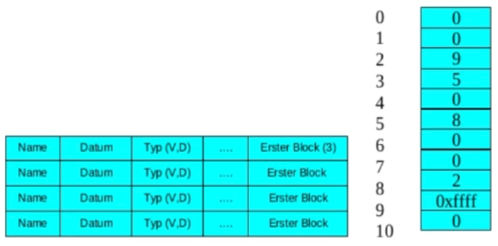

## Virtuelle Adressierung


> Beschreiben Sie die einstufige virtuelle Adressierung.

* Die Bildung der realen Adresse erfolgt in 2 Schritten.
* Die virtuelle Adresse wird in der MMU (Memory Management Unit) in 2 Teile zerlegt.
* Der rechte Teil (Offset) wird vorerst beiseitegelegt.
* Der linke Teil (Page) wird als Index in der Seitentabelle verwendet.
* Der Wert des Page-Index wird verwendet, um den entsprechenden Eintrag in der Seitentabelle auszuwählen.
* Der ausgewählte Eintrag enthält eine Wert mit 20 Bit (Real Page), der mit dem Offset kombiniert wird.
* Die resultierende Adresse wird als reale Adresse bezeichnet und wird zur Adressierung im Speicher verwendet.
* Die Adresse der Seitentabelle wird im Steuerregister CR3 des Prozessors oder der MMU gespeichert.
* Durch Ändern des Offset-Werts bleibt die Adressierung innerhalb derselben Seite, während sich der Wert der realen Seite ändern kann, was auf einen anderen Speicherbereich verweist.

> Welche Bedeutung haben die Einträge in der Page-Tabelle?

In der Page-Tabelle sind die Real-Pages drinnen, aus denen anhand des Offsets die Reelle Adresse errechnet wird.

---

> **In einem 32-Bit-System mit `4kB` großen Seiten wird die zweistufige virtuelle Adressierung eingesetzt.**
> 
> Wie viele Speicher und wie viele Tabellen braucht man mindestens für die Speichertabellen (PD, PT)
> eines kleinen Programms (mit Code, Date, Heap und Stack)?

```
2 PT, 1 PD (kleines Programm)

32 Bit -> 10 PD, 10 PT, 12 Offset

2^10 = 1024 Eintraege in dem PD
Jeder der Eintraege hat 32 Bit

=> Insgesamt 1024 * 32 Bit = 4 KiB

2^10 = 1024 Eintraege in der PT (= 4 KiB)

=> Insgesamt 4 KiB (PD) + 2 * 4 KiB (PT) = 12 KiB fuer die Tabellen

Falls fuer Code noch Speicher, dann noch `4 * 4 KiB` (4 KiB pro Page)
evtl. `2 * 4` KiB falls Daten, Code und Heap in ein Page kann

=> Insgesamt Insgesamt 28 KiB
```

> Wozu dient der TLB?

Der TLB (Translation Lookaside Buffer) ist ein Cache, der verwendet wird, um die Adressübersetzung bei der virtuellen Adressierung zu beschleunigen. Er enthält die kürzlich verwendeten Übersetzungseinträge (virtuelle Adresse zu physischer Adresse), um den Zugriff auf die Tabellen zu vermeiden.

Wenn ein Programm eine virtuelle Adresse verwendet, schaut der Prozessor zuerst im TLB nach, ob die Übersetzung vorhanden ist. Wenn ja, wird die physische Adresse direkt aus dem TLB abgerufen. Dieser Vorgang ist viel schneller als der Zugriff auf die Tabellen im Speicher.

Wenn die Übersetzung jedoch nicht im TLB vorhanden ist (ein sogenannter TLB-Miss), muss der Prozessor auf die Speichertabellen zugreifen, um die Übersetzung zu finden. In diesem Fall dauert die Adressübersetzung länger, da der Speicherzugriff zeitaufwändiger ist als der Zugriff auf den TLB.
 
> Für welche Bereiche des virtuellen Adressraums werden diese benötigt?

Daten, Code und Heap liegen am Anfang des v. A. Stack an Ende.
Deswegen wird fuer den Anfang und fuer das Ende ein PT gebraucht, welche beide im PD zu finden sind, welcher den gesamten virtuellen Adressraum abbildet.

---

> **Virtuelle Adressierung bei 32-Bit mit `4MB` Seiten.**
>
> Wie wird die Virtuelle Adresse aufgeteilt (quantitativ)?

Bei 4MB Seiten wird dem Offset 22 Bit zugeteilt und der Page 10 Bit anstatt bei bspw. 4 KiB Seiten, wo der Offset 12 Bit und Page 20 Bit bekommt.

> Wie "berechnet" die MMU dabei die reelle Adresse (Zeichnung)?
> **od.:** Beschreiben Sie die Funktionsweise der virtuellen Adressierung eines 32-Bit-Prozessors mit einer Seitengröße von 4MB


> Wie wird durch die virtuelle Adressierung verhindert, dass Programme auf fremden Adressraum zugreifen?

Anhand des P und W Bits. Ist (P = 0) oder (W = 0), so wird eine Exception ausgeloest. Dadurch wird die Anwendung unterbrochen.

> Wie vermeidet man, dass bei jeder Speicheradressierung die vollständige Adressumsetzung erfolgen muss?

TLB

---

> 
> 
> Beschreiben Sie, wie die reelle Adresse gebildet wird

Gleich wie bei der zweistufigen, nur mit 4 Stufen.

* PM schaut in PMLE Tabelle nach naechsten Wert, dieser referenziert auf PDPE Tabelle (fuer jeden Eintrag gibt es eine Tabelle)
* gleiches Spiel in dieser PDPE Tabelle
* gleiches Spiel in dieser PDE Tabelle
* gleiches Spiel in dieser PTE Tabelle
* Eintrag der PTE Tabelle mit Offset zusammenrechnen
* Erhaelt reelle Adresse

> Wie groß sind die Register?

* 2^9 Eintraege pro Tabelle
* (falls ein Eintrag 64 Bit gross ist, dann 2 ^ 9 * 64 Bit (= 512*64/8 Bytes = 4 KiB)) | HILFE

> Warum ist diese Tabellengröße gewählt? Was kann man tun, um größere Seiten hinzubekommen?

Optimum aus Zugriffzeiten bei Miss und Speicherbedarf.
Bei invalidem Eintrag (P = 0) kann man sich die folgenden Tabellen sparen.

Um groessere Seiten hinzubekommen muss man die Tabellen verkleinern und den Offset vergroessern. 
Fuer 4 MB Seiten zum Beispiel 22 Bit Offset, fuer 4 KB nur 12 Bit Offset.

---

> 
> 
> **Gegeben sei die virtuelle Adresse `0x5678` und der Anfang der Page-Tabelle (Einstufige Adressumsetzung, Seitengröße `4kB`)**
>
> Ermitteln Sie die reelle Adresse im Hauptspeicher

`0x5678` -> 0x5 (Page) 0x678 (Offset). An Index 5 in der Tabelle (6. Eintrag) steht `0x1234`. Ergbnis = `0x1234` + `0x678` = `0x1234678`

> Was geschieht, wenn dort ein Wert eingetragen wird?

P = Present (1. Spalte), W = Writable (2. Spalte). Falls (P = 0), dann existiert Tabelle nicht. Falls (W = 0), dann Tabelle nicht beschreibbar.
Da bei `0x1234678` (W = 0) ist, kann dort nicht beschrieben werden. Es wird eine Exception geworfen.

---

> Warum wird die einstufige virtuelle Adressierung nicht verwendet?

Auch fuer kleine Anwendungen muss die komplette Tabelle erstellt werden. Dadurch gibt es einen sehr hohen Speicheraufwand.

> Wie arbeitet die virtuelle Adressierung tatsächlich?

In echt verwendet man die Mehrstufige virtuelle Adressierung.

Bei der mehrstufigen virtuellen Adressierung wird die virtuelle Adresse in mehrere Teile aufgeteilt und durch mehrere Tabellenstufen geleitet, um die physische Adresse zu bestimmen. Der Index jeder Tabelle wird verwendet, um den Eintrag in der nächsten Tabelle zu finden, bis schließlich die physische Adresse erreicht wird (anhand von Kombination mit Offset). Dies ermöglicht eine effiziente Nutzung des virtuellen Adressraums und eine flexiblere Speicherverwaltung.

---


## Dateisysteme

> Funktionsweise ext4

` 🚨 answer missing `

---

> Funktionsweise ext2

` 🚨 answer missing `

---

> Funktionsweise FAT

` 🚨 answer missing `

---

> [ext4] Beschreiben Sie den Aufbau des Dateisystems `ext4`

` 🚨 answer missing `

---

> [ext4] Beschreiben Sie die Funktionsweise des ext4-Dateisystems mit Extents

` 🚨 answer missing `

---

> `[ext4]` Warum kann ext4 mit Extents größere Partitionen verwalten als ohne Extents

` 🚨 answer missing `

---

> `[ext4]` Wie groß kann eine Datei werden (Blockgröße 4 KiB, Rechenweg)

```
BN = 32 Bit (immer bei ext4)
Pro Datei = 2^32 Bloecke
BS = 4 KiB
Max. Datei = Anz. Bloecke * BS
           = 2^32 * 4 KiB = 16 TB
```

---

> **Gegeben sei ein ext2-Dateisystem mit einer Blockgröße von `4 KiB`.
> Im Dateikopf seien 12 Einträge für die direkte Adressierung von Datenblöcken und 3 Einträge für die Verweise auf 1 bis 3-fach indizierte Blöcke.**
>
> Wie groß kann eine Datei werden (Berechnungsformel)

```
BS = 1 KiB
BN = 32 Bit (immer bei ext2)

Anzahl Eintraege indirekte Bloecke = BS (in Bit) / BN = 1024 * 8 / 32 = 256

Max. Groesse = Direkte * BS + Anzahl Eintraege indirekte Bloecke ^ Indizierungslevel * BS
Max. Groesse = 12 * 1 KiB + 256 * 1 KiB + 256^2 * 1 KiB + 256 ^ 3 * 1 KiB
```

---

> 
> 
> **Ein Dateisystem sei wie im Bild aufgebaut. Die Blockgröße sei `1kB`.**
>
> Was stellt die linke Grafik dar, was die rechte?

Links: Wurzelverzeichnis, Rechts: FAT

> Wie lange ist die Datei (erste Zeile) maximal?

3 -> 5 -> 8 -> 2 -> 9 -> 0xffff => 5 Schritte = max. 5 * 1 KiB

> Um welches Dateisystem handelt es sich?

FAT16 (weil 0xffff = 16 Bit)

> Welche Angabe fehlt, um die genaue Dateigröße zu bestimmen?

Das genaue Ende der Datei im Block. 1 Block wird immer verwendet, muss aber nicht ausgefuellt sein. Dadurch groesse so nicht bestimmbar.
Wir braeuchten noch aus den Meta Daten die Groesse.

---


## Prozesskommunikation

> Wie kann der Empfänger vom Senden der Nachricht informiert werden, wenn er nicht dauernd nachfragen will?

* **Signale**: Der sendende Prozess sendet ein Signal an den empfangenden Prozess, um ihn über eine neue Nachricht zu informieren. Der empfangende Prozess hat einen Signal-Handler, der das Signal abfängt und die Nachricht verarbeitet.

* **Systemaufrufe**: Der sendende Prozess verwendet einen spezifischen Systemaufruf, um den empfangenden Prozess über die Nachricht zu benachrichtigen. Der empfangende Prozess ruft den entsprechenden Systemaufruf auf, um die Nachricht abzurufen.

* **Synchronisationsmechanismen**: Es werden Synchronisationsmechanismen wie Semaphore, Mutex oder Bedingungsvariablen eingesetzt. Der sendende Prozess setzt einen entsprechenden Synchronisationspunkt, um den empfangenden Prozess zu benachrichtigen. Der empfangende Prozess überprüft den Synchronisationspunkt und liest die Nachricht, wenn sie verfügbar ist.

---

> **Ein Prozess möchte einem anderen Prozess Nachrichtenblöcke variabler Länge schicken. Der Empfänger möchte die Nachricht mit einem Aufruf lesen, ohne die Länge der Nachrichten zu kennen.**
>
> Welches Kommunikationsmittel sollte man dafür verwenden?

Verwendung einer Nachrichtenwarteschlange (**Message Queue**).

* ermöglicht die Übertragung von Nachrichten zwischen Prozessen.
* Nachrichten können variable Längen haben.
* Nachrichtenwarteschlange funktioniert als Pufferstruktur.
* Der sendende Prozess schreibt Nachrichtenblöcke in den Puffer.
* Der empfangende Prozess liest die Nachrichtenblöcke aus dem Puffer.
* Puffer kann verschiedene Längen von Nachrichten aufnehmen.

---

> Vergleichen Sie die Eigenschaften von Pipes und Message-Queues

**Pipes**

* Unnamed und Named Pipes
    * Unnamed entstehen bei Fork zwischen Vater und Kind Prozessen
    * Named koennen zwischen allen Prozessen enstehen (Verwandschaftsgrad egal)
* Unidirektionale Kommunikation
* FIFO (First-In-First-Out) Datenfluss
* Verbindung zwischen verwandten Prozessen
* Implementiert mit Dateideskriptoren
* Begrenzter Puffer

**Message-Queues**

* Bidirektionale Kommunikation
* Nicht-FIFO oder Prioritäten beim Lesen
* Verbindung zwischen beliebigen Prozessen
* Implementiert als Kernel-Objekte
* Flexible Puffergröße

---

> Was sind Signale?

Signale sind Ereignisse oder Benachrichtigungen, die einem Prozess gesendet werden, um auf bestimmte Ereignisse hinzuweisen oder bestimmte Aktionen auszulösen.
Sie dienen der Kommunikation und Koordination zwischen Prozessen oder zwischen dem Betriebssystem und einem Prozess.

> Wie werden sie behandelt?

Ein Prozess kann Signale empfangen und darauf reagieren, indem er Signal-Handler-Funktionen definiert.
Der Prozess kann Signal-Handler registrieren, um auf bestimmte Signale zu reagieren und entsprechende Aktionen auszuführen.
Es gibt verschiedene Möglichkeiten, Signale zu behandeln, einschließlich Ignorieren des Signals, Ausführen einer Standardaktion oder Ausführen einer benutzerdefinierten Aktion.
Einige Signale können blockiert werden, um ihre Ausführung vorübergehend zu verhindern.
Signale können auch an andere Prozesse gesendet werden, um mit ihnen zu kommunizieren oder bestimmte Aktionen auszulösen.

---

> Warum kann man einzelne Signale nicht überladen?

Einzelne Signale können nicht überladen werden, da sie standardisierte Bedeutungen haben, die konsistent und interoperabel sein müssen. Die einheitliche Signalbehandlung erleichtert die Systemimplementierung, -leistung und -vorhersagbarkeit.

---

> Warum kann man Signale überladen?

* Signale können maskiert werden, um vorübergehend ihre Behandlung zu unterdrücken.
* Maskierte Signale werden von einem Prozess ignoriert und nicht verarbeitet.
* Maskierte Signale werden in einer Signalmaske gespeichert, die vom Betriebssystem verwaltet wird.
* Das Maskieren von Signalen ermöglicht die Steuerung der Signalverarbeitung auf granularer Ebene.
* Maskierte Signale können später wieder entsperrt werden und werden dann normal verarbeitet.

---

> Was ist ein Semaphor? Wie wird er verwendet?

* Ein Semaphore ist eine Synchronisationsprimitive.
* Es ist ein ganzzahliger Zähler im Kernel.
* werden verwendet, um den Zugriff auf gemeinsame Ressourcen zu steuern.
* helfen bei Synchronisation und Koordination von Prozessen/Threads.

Wenn auf 0 wird blockiert, wenn er benutzt wird, um 1 dekrementiert, wenn nicht mehr benutzt, um 1 inkrementiert.

---


## Prozesse

> **Was ist ein Prozess?**

Als Prozesse bezeichnet man **Programme**, die im **Hauptspeicher** zur Ausführung kommen.


> Welche Zustände kann er einnehmen?

`wartend`, `ausgelagert`, `bereit`, ...

> Wie gelangt er von einem Zustand in einen anderen?

`wartend` -> `ausgelagert` = `Auslagerung`, ...

---

> Erklären Sie Multilevel Feedback Scheduling

* Annahme: Dialogorientierte Prozesse benötigen wenig Rechenzeit, fordern jedoch kurze Antwortzeiten.
* Beim Start: Prozess erhält die höchste Priorität.
* Nutzung der Zeitscheibe: Wenn Prozess Zeitscheibe im nächsten Zyklus vollständig ausnutzt, wird er in eine tiefere Prioritätsebene versetzt.
* Nicht-Ausnutzung der Zeitscheibe: Wenn der Prozess die Zeitscheibe nicht vollständig ausnutzt, verbleibt er in der Startpriorität.
* Ergebnis: Rechenintensive Prozesse werden immer weiter abgestuft, während Prozesse, die in der Regel ihre Zeitscheibe nicht nutzen (wie Dialogprozesse), bevorzugt den Prozessor erhalten.

---

> Nennen Sie 2 Gründe/Vorteile, weshalb diese Methode eingesetzt wird

* Priorisierung von dialogorientierten Prozessen
* Effiziente Ressourcennutzung
* Versetzung rechenintensiver Prozesse in tiefere Prioritätsebenen
* Größere Chance für dialogorientierte Prozesse, den Prozessor zu nutzen
* Ausgewogenere Auslastung des Systems

---

> Was ist ein Thread?

* Eine ausführbare Einheit innerhalb eines Prozesses.
* ermöglichen die parallele Ausführung mehrerer Aufgaben innerhalb eines Prozesses.
* teilt sich den Speicherbereich mit anderen Threads desselben Prozesses.
* Threads können auf globale Daten und Variablen des Prozesses zugreifen.
* Threads können unabhängige Aufgaben ausführen und den Prozessor freiwillig abgeben.

---

> Wie verhalten sich Prozesse gegenüber Threads?

* Prozesse sind eigenständige Ausführungseinheiten, während Threads innerhalb eines Prozesses existieren.
* Prozesse haben einen eigenen Adressraum, Threads teilen sich den Adressraum eines Prozesses.
* Prozesse sind isoliert und können nicht direkt auf den Speicher oder die Variablen anderer Prozesse zugreifen, Threads können auf gemeinsam genutzte Ressourcen (im selben Prozess) zugreifen.
* Prozesse erfordern eine Kontextumschaltung, um zwischen ihnen zu wechseln, Threads können direkt gewechselt werden.
* Threads haben weniger Overhead und benötigen weniger Ressourcen im Vergleich zu Prozessen.
* Threads können parallel ausgeführt werden und die CPU-Ressourcen effizient nutzen.

---

> Was sind KLTs (Kernel-Level Threads)?

* KLTs werden vom Betriebssystem auf Kernenebene verwaltet.
* Erzeugen und Verwalten von KLTs erfordert Systemcalls.
* KLTs können blockierende Systemcalls verwenden.
* Betriebssystem gewährt KLTs Prozessorzeit basierend auf der Scheduling-Strategie.

> Was sind ULTs (User-Level Threads)?

* ULTs werden auf Anwendungsebene durch eine Thread-Bibliothek verwaltet.
* ULTs sind Teil desselben Prozesses und teilen sich den Adressraum.
* ULTs erfordern keine Systemcalls für Erzeugung und Verwaltung.
* ULTs müssen die CPU-Ressourcen freiwillig abgeben (yield) oder asynchrone Systemaufrufe verwenden.
* Das Betriebssystem betrachtet ULTs als einen einzigen Prozess und gewährt ihm Prozessorzeit.

---

> Zeigen Sie die Speicherbelegung von Threads


---

> Welcher Typ von Threads kann ein Mehrprozessorsystem nutzen? Warum?

KLTs können ein Mehrprozessorsystem nutzen, da jeder Thread als eigenständiger Prozess anerkannt wird und auf mehrere Prozessoren aufgeteilt werden kann. 
Bei ULT werden alle Threads als ein Prozess erkannt -> schlecht

---

> Sie haben mehrere Threads, die ihre Ergebnisse in einer gemeinsamen Variable aufsummieren.
> Können Sie, da die Addition kommutativ ist, auf kritische Bereiche verzichten?

Nein, auf kritische Bereiche kann nicht verzichtet werden, weil die Addition einer Zahl auf eine gemeinsame Variable und überschreiben dieser Variable nicht in einem Befehl möglich ist. Dadurch würden Inkonsistenzen entstehen. 

> Wenn nein, wie würden Sie das Problem lösen?

Ein Semaphor könnte eingesetzt werden. Dabei handelt es sich um einen im Kernel 
befindlichen Zähler, der anzeigt, ob die gemeinsame Variable gerade in Benutzung ist 
oder nicht. Ein Prozess kann einen Semaphor belegen und freigeben.

---

> Was sind Memory Mapped Files?

Memory Mapped Files sind eine Technik zur Abbildung von Dateien in den Arbeitsspeicher eines Computers. Durch die Verwendung von Memory Mapped Files kann auf den Inhalt einer Datei direkt über Speicherzugriffe zugegriffen werden, ohne dass explizite Lese- oder Schreiboperationen durchgeführt werden müssen.

> Beschreiben Sie die Funktionsweise

* Beim Aufruf `mmap()` wird ein bestimmter Ausschnitt einer Datei im virtuellen Adressraum eines Prozesses abgebildet.
* Beim Zugriff auf den abgebildeten Speicherbereich wird ein Page Fault ausgelöst, da die Daten möglicherweise nicht im Hauptspeicher vorhanden sind.
* Das Betriebssystem lädt die entsprechende Seite der Datei in den Hauptspeicher und setzt die Anwendung mit dem fehlgeschlagenen Befehl fort.
* Der Prozess kann nun direkt auf den Inhalt der Datei über Speicherzugriffe zugreifen, ohne explizite Lese- oder Schreiboperationen durchzuführen.
* Änderungen im Speicher werden automatisch in die Datei geschrieben, und Lesen aus dem Speicher liefert den aktuellen Inhalt der Datei.
* Memory Mapped Files ermöglichen effizienten Zugriff auf große Dateien und vereinfachen den Umgang mit Dateiinhalten durch die Nutzung von Speicherzugriffen.

---

**Copy-On-Write:**

> Warum führt `copy_on_write` zur beschleunigten Ausführung eines Child-Prozesses nach `fork()`

Die beschleunigte Ausführung eines Child-Prozesses nach `fork()` wird durch die Copy-on-Write-Strategie ermöglicht. Dabei greifen beide Prozesse über ihre Pagetable, es gibt zwei, auf den gleichen Anwendungsadressraum zu. Die Einträge in der Pagetable sind schreibgeschützt (W = 0). Wenn einer der Prozesse schreiben möchte, wird eine Exception ausgelöst, woraufhin die Page kopiert und der Schreibschutz der entsprechenden Eintraegen der Pagetable entfernt wird. Dadurch wird Speicher effizient genutzt, da Kopien und Ressourcenallokation nur bei tatsächlichen Schreibzugriffen erfolgen. Dies führt zu einer beschleunigten Ausführung des Child-Prozesses.

> Was geschieht, wenn einer der Prozesse eine Globalvariable modifiziert?

` 🚨 answer missing `

> Was geschieht bei einem Unterprogrammaufruf?

Zur Ausführung des Systemcalls `exec()`, wird der komplette Adressraum des Kindes überschrieben. 
Dann muss der vollständige neue Adressraum gebildet werden, bzw. bildet er sich durch Demand Paging auch wieder nur im benötigten Umfang neu.

---

> Warum wird bei Linux und Windows der Anwendungsadressraum von 4GB auf 3GB (Windows 2GB) verkleinert?

* Platz für das Betriebssystem im reservierten Adressraum
* Linux reserviert 1GB, Windows 2-3GB für das Betriebssystem
* Diese Reduzierung ermöglicht es, dass das Betriebssystem und die Anwendungen beide Adressräume gleichzeitig sichtbar haben. Bei 64-Bit-CPUs ist diese Einschränkung nicht erforderlich.

> Welche Vorteile hat diese Maßnahme bei einem Systemcall

* Direkter Zugriff des Betriebssystems auf virtuelle Adressen der Anwendung
* Keine Umrechnung der Adressen erforderlich
* Kein Wechsel zwischen Adressräumen
* Vermeidung von TLB- und Cache-Invalidierungen
* Beschleunigung der Systemaufrufe

> Welche Vorteile hat diese Maßnahme beim Datentransfer

* Das Betriebssystem kann beim Zugriff auf Anwendungsdaten die virtuellen Adressen (Pointer) verwenden ohne sie umzurechnen, oder zwischen verschiedenen Adressraeumen umschalten zu muessen
* Auch TLB und der Cache muessen beim Eintritt ins Betriebssystem nicht invalidiert werden

---

> Was ist eine Race-Condition?

Eine Race-Condition ist eine Situation, in der das Verhalten eines Programms oder Systems davon abhängt, in welcher Reihenfolge die einzelnen Threads oder Prozesse ausgeführt werden.

> Welche Fehler können auftreten?

Mögliche Fehler, die durch Race-Conditions auftreten können, sind:

* Inkonsistente oder fehlerhafte Ergebnisse aufgrund von parallelen Aktualisierungen von gemeinsam genutzten Ressourcen.
* Deadlocks oder Blockaden, bei denen Threads oder Prozesse aufeinander warten und dadurch das System blockiert wird.
* Datenverlust oder Datenbeschädigung durch inkonsistente Schreib- oder Leseoperationen.

> Wie kann man diese vermeiden?

* Synchronisierung: Verwendung von Mechanismen wie Mutexes (Sperren) oder Semaphoren, um den Zugriff auf gemeinsam genutzte Ressourcen zu koordinieren und sicherzustellen, dass nur ein Thread oder Prozess gleichzeitig darauf zugreift.
* Kritische Abschnitte: Identifizierung und Kennzeichnung von kritischen Abschnitten im Code, in denen gemeinsam genutzte Ressourcen verwendet werden, und deren schützende Umrahmung mit Synchronisierungsmechanismen.
* Atomare Operationen: Verwendung von atomaren Operationen, die als unteilbare Einheiten ausgeführt werden und keine Race-Conditions verursachen können.
* Thread-Sicherheit: Entwicklung und Gestaltung von Code und Algorithmen, die sicher in einem Mehrbenutzer-/Mehrprozessorsystem ausgeführt werden können, indem mögliche Race-Conditions von vornherein vermieden werden.

---

> Fünf Aufträge warten auf ihren Start. Ihre erwarteten Laufzeiten sind 9, 5, 3 und 5 sec.
> In welcher Reihenfolge sollten sie laufen, damit die mittlere Antwortzeit minimiert wird?

Von der kuerzesten Zeit zur laengsten Zeit, also `3`, `5`, `5`, `9`.
Mittlere Antwortzeit ist (3 + 8 + 13 + 22) / 4 = 11.5

---

> Warum werden Seiten ausgelagert?

Seiten werden ausgelagert, um **Speicherplatz im Hauptspeicher freizugeben** und **Platz für andere Seiten oder Prozesse zu schaffen**. Dies geschieht, wenn der verfügbare Hauptspeicher nicht ausreicht, um alle aktiven Seiten aller laufenden Prozesse zu halten.

> Was geschieht dabei?

Beim Auslagern einer Seite wird der Inhalt dieser Seite vom Hauptspeicher auf die Festplatte oder ein anderes sekundäres Speichermedium verschoben. Dadurch wird der Speicherplatz im Hauptspeicher freigegeben, und die Seite wird als "ausgelagert" markiert. Wenn die Seite später wieder benötigt wird, kann sie vom sekundären Speicher in den Hauptspeicher zurückgeladen werden.

> Welche Strategien gibt es?

**Optimal**

Diese Strategie existiert nur theoretisch. Dabei müsste man in die Zukunft sehen können, um herauszufinden, welche Seite nie wieder bzw. am spätesten wieder gebraucht wird.

**FIFO**

Beim Einlagern einer Seite in den Hauptspeicher wird sie mit einem Zeitstempel versehen. Wenn der Hauptspeicher zu voll wird, werden Seiten mit dem frühesten Zeitstempel als erstes verdrängt.
→ In den meisten Fällen sinnlos, da System-Dienste früh gestartet werden und immer gebraucht werden

**Clock-Algorithmus**

Zwei Zeiger durchlaufen hintereinander mit etwas Abstand die Pages im RAM. 
Der vordere Zeiger setzt das Access-Bit jeder Seite auf 0. Wenn auf eine Seite 
zugegriffen wird, wird dieses Bit auf 1 gesetzt. 
Der hintere Zeiger prueft, ob das Access-Bit auf 0 gesetzt ist, ist dies der Fall, wird die Seite ausgelagert.

**LRU**

Für jede Seite wird ein Bit-Vektor gespeichert. Direkt nach der Einlagerung sind 
alle Bits 0. In regelmäßigen Zeitabständen prüft nun das BS für jede Page im 
HS ihr Access-Bit und schiebt es an den Anfang des Bit-Vektors, so dass sich 
die anderen Bits um eine Stelle verschieben und ein Bit hausfällt. Anschließend 
setzt er das Access-Bit auf 0.
Sieht man den Bit-Vektor als Binärzahl an, gibt diese Zahl eine Aussage 
darüber, wie oft in letzter Zeit auf diese Page zugegriffen wurde. Pages mit 
niedrigerer Zahl können also eher ausgelagert werden.

---

> Was ist ein "Seitenfehler"?

Ein "Seitenfehler" (auch bekannt als Page Fault) tritt auf, wenn ein Prozess auf eine Seite im virtuellen Speicher zugreifen möchte, die sich nicht im Hauptspeicher befindet.

> Wodurch wird er verursacht?

* Die angeforderte Seite wurde noch nicht in den Hauptspeicher geladen, da sie entweder noch nicht benötigt wurde oder zuvor ausgelagert wurde.
* Die angeforderte Seite wurde ausgelagert, um Platz für andere Seiten oder Prozesse zu schaffen.
* Es kann ein Fehler im Adressraum des Prozesses vorliegen, der dazu führt, dass auf ungültige Adressen zugegriffen wird.

> Welche grundsätzlichen Reaktionen darauf gibt es?

* Laden: Die angeforderte Seite wird vom sekundären Speicher (z. B. Festplatte) in den Hauptspeicher geladen, damit der Prozess darauf zugreifen kann. Der Prozess wird dann fortgesetzt, als ob nichts passiert wäre.
* Austauschen: Wenn der Hauptspeicher voll ist, muss eine andere Seite ausgelagert werden, um Platz für die angeforderte Seite zu schaffen. Die ausgelagerte Seite wird auf die Festplatte verschoben, und die angeforderte Seite wird an ihre Stelle im Hauptspeicher geladen.
* Fehlerbehandlung: Wenn der Seitenfehler auf einen ungültigen Zugriff oder einen anderen schwerwiegenden Fehler hinweist, kann das Betriebssystem den Prozess beenden oder eine entsprechende Fehlerbehandlung durchführen

---


## Virtualisierung

> Was ist ein Typ-1 Hypervisor?

**Typ-1 Hypervisor (Bare-Metal Hypervisor):**

* **Das Gastsystem laeuft in einer niedrigen Privilegstufte**
    * Kritische oder sensitive Instruktionen werfen eine Exception.
    * Werden von der VMM (Virtual Machine Monitor) abgearbeitet.
* Wird auch als "Bare-Metal Hypervisor" bezeichnet.
* Wird direkt auf der physischen Hardware (ohne ein Host-Betriebssystem) installiert.
* Hat direkten Zugriff auf die Hardware-Ressourcen des Systems.
* Bietet eine hohe Leistung und Effizienz, da kein Host-Betriebssystem vorhanden ist.

> Was ist ein Typ-2 Hypervisor?

**Typ-2 Hypervisor (Hosted Hypervisor):**

* Wird auch als "Hosted Hypervisor" bezeichnet.
* Wird auf einem Host-Betriebssystem installiert.
* Teilt die Hardware-Ressourcen des Host-Betriebssystems mit den virtualisierten Gästen.
* Hat weniger direkten Zugriff auf die Hardware als ein Typ-1 Hypervisor.
* Bietet eine höhere Flexibilität, da das Host-Betriebssystem verschiedene Anwendungen ausführen kann.
* Wird häufig auf Desktop-Computern für Virtualisierungszwecke verwendet.

---

> Was ist die Voraussetzung eines Typ-1 Hypervisors?

* Erfordert eine physische Hardware, auf der er direkt ausgeführt werden kann.
* Benötigt Zugriff auf die grundlegenden Hardware-Ressourcen des Systems, wie CPU, Speicher, Festplatten und Netzwerkgeräte.
* Die Hardware sollte Virtualisierungstechnologien unterstützen, z. B. Intel VT-x oder AMD-V, um die Virtualisierungseffizienz zu verbessern.
* Der Hypervisor benötigt möglicherweise spezifische Treiber für die Hardware-Komponenten, um eine optimale Leistung und Funktionalität zu gewährleisten.

---

> Was ist die Voraussetzung eines Typ-2 Hypervisors?

* Die Installation eines Typ-2 Hypervisors erfordert ein Host-Betriebssystem auf der physischen Hardware.
* Das Host-Betriebssystem sollte für die Virtualisierung geeignet sein und die Installation und Ausführung von Hypervisor-Software ermöglichen.
* Der Hypervisor nutzt die Ressourcen des Host-Betriebssystems, einschließlich der Hardware-Ressourcen wie CPU, Speicher und Netzwerk.
* Die Hardware des Systems sollte Virtualisierungstechnologien unterstützen, um die Virtualisierungsleistung zu verbessern.
* Der Typ-2 Hypervisor kann von den Funktionen und Treibern des Host-Betriebssystems abhängig sein, um eine optimale Funktionalität zu bieten.

---

> Wie verhindert ein Typ-1 Hypervisor, dass ein Gastsystem direkt auf die Hardware zugreift?

* Die Privilegstufe der Gastsysteme wird heruntergesetzt
* Er besteht aus einer Virtual Machine Monitor (VMM) Schicht, die den direkten Zugriff auf die Hardware ermöglicht.
* Der Hypervisor kontrolliert den Zugriff auf die physischen Ressourcen wie Prozessor, Speicher, Netzwerk und Speichermedien.
* Er stellt eine virtuelle Umgebung für die Gastsysteme bereit, in der sie ausgeführt werden können.
* Der Hypervisor bietet eine hohe Leistung und Effizienz, da er direkt mit der Hardware interagiert.
* Durch die Isolierung der Gastsysteme voneinander und vom Hypervisor wird die Sicherheit und Stabilität gewährleistet.

---

> Wie verhindert ein Typ-2 Hypervisor, dass ein Gastsystem direkt auf die Hardware zugreift?

* Er greift nicht direkt auf die physische Hardware zu, sondern nutzt die Treiber und Schnittstellen des Host-Betriebssystems.
* Der Hypervisor arbeitet als Schicht zwischen dem Host-Betriebssystem und den Gastsystemen.
* Der Host-Betriebssystem kontrolliert den Zugriff auf die Hardware-Ressourcen und stellt sie dem Hypervisor zur Verfügung.
* Der Hypervisor ermöglicht die Ausführung mehrerer Gastsysteme als separate virtuelle Maschinen.
* Durch den sicheren Zugriff auf die physischen Ressourcen durch den Hypervisor werden die Gastsysteme voneinander isoliert und geschützt.

---

> **Bei modernen Systemen ist die Virtualisierung schon von Haus aus im Prozessor integriert.**

> Welchen zusätzlichen Hardwarebaustein braucht man, um Nested Page Tables zu unterstützten?

MMU-VM

> Welche Eigenschaften muss ein Peripheriegerät vorweisen, um I/O-Virtualisierung zu unterstützen?

` 🚨 answer missing `

---

> Was ist ein Container?


* Container bieten Anwendungen eine abgeschottete Umgebung, die unabhängig von anderen Containern ist.
* Container teilen sich das gleiche Betriebssystem, ermöglichen aber die Einbindung unterschiedlicher Versionen von Bibliotheken.
* Container bestehen aus Images, die den Inhalt des Containers sowie die Startparameter enthalten.
* Die Container-Engine ist für das Starten, Stoppen und Verwalten der Container zuständig.
* Die Container-Engine ermöglicht die Kommunikation zwischen den Containern sowie mit Anwendungen außerhalb der Container und des Host-Rechners.

---

> Was ist ein Emulator?

* Emulation ermöglicht die Nachbildung beliebiger Systeme.
* Ein Emulator liest den Binärcode des emulierten Systems aus und führt ihn Befehl für Befehl in einem Softwaremodell des Prozessors oder des gesamten Systems aus.
* Emulationssysteme eignen sich hauptsächlich für Entwicklung und Testzwecke.
* Die Geschwindigkeit eines emulierten Systems ist im Vergleich zum Originalsystem meist deutlich geringer, typischerweise nur 20-30% der Leistung.
* Emulatoren wie Qemu und Bochs sind Beispiele für solche Systeme.
* Wine ist ein spezieller Fall, bei dem eine virtuelle Betriebssystemschnittstelle bereitgestellt wird, um Windows-Anwendungen auf Linux-Systemen auszuführen.

---

> Was ist eine I/O-MMU? Und wofür wird sie verwendet?

* Eine I/O-MMU wird verwendet, um den direkten Zugriff von Gastbetriebssystemen auf virtuelle Geräte zu ermöglichen.
* Der direkte Zugriff auf virtuelle Geräte kann jedoch Gefahren für die Gesamtfunktion des Systems mit sich bringen, insbesondere wenn die Geräte DMA-fähig sind.
* DMA (Direct Memory Access) erlaubt es Geräten, Daten direkt zwischen dem Arbeitsspeicher und dem Gerät zu übertragen, ohne die CPU zu belasten.
* Die I/O-MMU ähnelt einer MMU (Memory Management Unit) und verwendet Seitentabellen, um Adressen von virtuellen Geräten auf physikalische Adressen im Arbeitsspeicher abzubilden.
* Die I/O-MMU wird vom VMM (Virtual Machine Monitor) parametriert und ermöglicht den Gastsystemen, dieselben DMA-Adressen zu verwenden, während die I/O-MMU die Zuordnung zu den physikalischen Adressräumen der virtuellen Maschinen vornimmt.
* Die I/O-MMU gewährleistet einen sicheren und effizienten Zugriff der Gastsysteme auf virtuelle Geräte und ermöglicht eine sichere Kommunikation zwischen den virtuellen Maschinen und den virtuellen Geräten.

---


## Systemaufrufe

> **Erklären Sie die Funktion und Wirkungsweise folgender System-Calls:**

* `fork()`: Erzeugt einen neuen Prozess, der eine exakte Kopie des aufrufenden Prozesses ist. Der neue Prozess, auch Kindprozess genannt, erhält eine eindeutige Prozesskennung (PID) und eine Kopie des Adressraums, der Dateideskriptoren und anderer Ressourcen des Elternprozesses.
* `wait()`: Blockiert den Elternprozess und wartet auf die Beendigung eines oder mehrerer Kindprozesse. Der Aufruf von `wait()` ermöglicht es dem Elternprozess, auf den Abschluss der Ausführung seiner Kindprozesse zu warten, bevor er selbst fortfährt.
* `exit()`: Beendet den aktuellen Prozess und gibt Ressourcen frei. Optional kann ein Beendigungsstatus übergeben werden.
* `exec()`: Startet ein neues Programm in einem Prozess, indem der aktuelle Programmcode durch den Code des neuen Programms ersetzt wird.

---

> Beschreiben Sie den Ablauf eines Systemcalls am Beispiel des Aufrufs `write()` in eine Datei.

System-Calls werden durch Interrupts realisiert. Dazu wechselt eine Anwendung mittels eines Software-Interrupts in den Kontext des BS. Dort wird der Auftrag ausgewertet und an den Treiber weitergeleitet. Dieser wandelt den abstrakten Auftrag in einen Auftrag um, der von den entsprechenden Geräten verstanden wird. Der Treiber gibt nun die CPU frei. Sobald das Gerät seine Auswertung abgeschlossen hat, wird ein Interrupt an den Treiber geschickt. Der Treiber informiert anschließend den Scheduler, welcher wiederum über die weitere Ausführung entscheidet. Per Iret wird nun die Interruptreaktionsroutine beendet.

---

> Wozu dienen Interrupts ausgelöst durch Hardware?

* Behandlung von Hardwareereignissen: Hardware-Interrupts werden von physischen Geräten, wie z.B. Tastaturen, Mäusen, Netzwerkkarten oder Timern, ausgelöst. Sie signalisieren dem Prozessor, dass eine bestimmte Aktion oder ein Ereignis eingetreten ist, das Aufmerksamkeit erfordert.
* Echtzeitverarbeitung: Hardware-Interrupts ermöglichen es dem System, auf zeitkritische Ereignisse sofort zu reagieren. Beispielsweise kann ein Interrupt ausgelöst werden, wenn ein Netzwerkpaket eingetroffen ist, um es schnell zu verarbeiten und zu reagieren.

---

> Wozu dienen Interrupts ausgelöst durch Software?

* Betriebssystemsteuerung: Software-Interrupts, auch als Trap oder Software Trap bezeichnet, werden vom Betriebssystem selbst oder von Anwendungen ausgelöst, um eine bestimmte Funktion im Betriebssystem auszuführen. Sie dienen dazu, vom Benutzer angeforderte Systemdienste oder Betriebssystemfunktionen zu aktivieren, z.B. das Öffnen einer Datei oder das Ausführen eines bestimmten Befehls.
* Synchronisation und Koordination: Software-Interrupts werden auch verwendet, um die Kommunikation und Koordination zwischen verschiedenen Prozessen oder Threads innerhalb des Systems zu ermöglichen. Sie können dazu verwendet werden, Signale oder Ereignisse zu senden, um auf bestimmte Bedingungen zu warten oder um eine asynchrone Kommunikation zwischen verschiedenen Teilen des Systems zu ermöglichen.

---


## Treiber

> Was ist ein Device-Switch-Table?

* Device-Switch-Table ist eine Datenstruktur im Betriebssystem.
* Sie verwaltet den Zugriff auf verschiedene Geräte (Hardware oder virtuelle Geräte).
* Jedes Gerät hat einen Eintrag in der Tabelle.
* Die Tabelle enthält Informationen und Funktionen zur Steuerung und Kommunikation mit den Geräten.
* Sie abstrahiert die Gerätekommunikation und bietet eine einheitliche Schnittstelle.
* Betriebssystem kann auf die Funktionen in der Tabelle zugreifen, um Geräteaktionen auszuführen.
* Sie ermöglicht einfache Erweiterung des Systems um neue Geräte.
* Wichtiger Bestandteil des Gerätetreiber-Frameworks.

---

> Was bedeutet Minor- und Major-Number?

**Major-Number:** Die Major-Number identifiziert den Gerätetreiber, der ein bestimmtes Gerät in einem Betriebssystem unterstützt. Sie stellt eine eindeutige Kennung für den Treiber dar und wird verwendet, um den entsprechenden Treiber im Kernel zu identifizieren.

**Minor-Number:** Die Minor-Number wird verwendet, um ein spezifisches Gerät zu identifizieren, das von einem bestimmten Treiber unterstützt wird. Sie ermöglicht die Unterscheidung zwischen verschiedenen Geräten desselben Treibers. Die Minor-Number kann verwendet werden, um auf bestimmte Geräteinstanzen oder Funktionen innerhalb eines Gerätetreiberbereichs zuzugreifen.

Zusammen bilden die Major- und Minor-Numbers eine eindeutige Kennung für ein Gerät in einem Unix-System.

---

> Was sind Block-Devices?

* Block-Geräte sind Geräte, die Daten in Blöcken (festgelegte Datenmengen) verarbeiten.
* Sie ermöglichen den zufälligen Zugriff auf Datenblöcke und unterstützen Lese- und Schreibvorgänge in größeren Einheiten.
* Typische Beispiele für Block-Geräte sind Festplatten, Solid-State-Laufwerke (SSDs) und CD/DVD-Laufwerke.
* Block-Geräte werden normalerweise zur Speicherung und Übertragung großer Datenmengen verwendet.

> Character Devices?

* Character-Geräte sind Geräte, die Daten zeichenweise verarbeiten.
* Sie ermöglichen den sequenziellen Zugriff auf Daten, d.h. die Daten werden in der Reihenfolge ihres Eintreffens verarbeitet.
* Typische Beispiele für Character-Geräte sind Tastaturen, Mäuse, serielle Schnittstellen und Soundkarten.
* Character-Geräte werden oft für die Eingabe und Ausgabe von Daten verwendet, die in Echtzeit erfolgen oder eine zeichenweise Verarbeitung erfordern.

---

> Welche Aufgaben hat ein Gerätetreiber?

- Bereitstellung einer allgemeinen Geräteschnittstelle
- Abstraktion der Gerätefunktionen (auf read, write, ...)

---

> Was versteht man unter "raw" und "cooked"?

Zeichenorientierte Geräte können über diese beiden Schnittstellen angesprochen werden. Die "cooked"-Schnittstelle wird verwendet, um z.B. ganze Eingabezeilen einzulesen. Die Benutzereingaben werden dabei aufbereitet (cook) und Zeichen wie Backspace interpretiert, anstatt sie direkt weiterzugeben. Die "raw"-Schnittstelle gibt alle Zeichen, so wie sie vom Nutzer eingegeben werden, an das System weiter, ohne sie zu interpretieren.

---


## Dialogsysteme

> Beschreiben Sie die Funktionsweise eines Fenstersystems

Ein Fenstersystem teilt den Bildschirm in verschiedene Bereiche (Fenster) ein.
Zuordnung von Eingaben zu aktivem Fenster durch Window-Manager.
Ereignisse (Maus-Klick) -> Hardware-Interrupt -> USB-Treiber -> Window-Manager -> Übermittlung an Anwendung -> Zurückgeben von Ausgabe

---


## Unkategorisiert

> Welche Instruktionen eines Prozessors müssen privilegiert sein, um einen sicheren Betrieb eines Systems zu gewährleisten?

* Manipulation der Privilegstufen
* Manipulation der Adressierungsmechanismen
* Setzen der Interruptsperre
* Verwenden der I/O-Befehle

---

> Wie wird Shared Memory realisiert?

* Das Reservieren eines gemeinsamen Speicherbereichs im Hauptspeicher des Computers
* Das Zuweisen dieses Speicherbereichs an mehrere Prozesse
* Die Prozesse können dann direkt auf den gemeinsamen Speicherbereich zugreifen und Daten austauschen, ohne Daten zwischen den Prozessen kopieren zu müssen.

> Wozu wird es verwendet?

* Effizienten und schnellen Datenaustausch zwischen Prozessen
* Gemeinsame Nutzung großer Datenmengen ohne Datenkopien
* Kommunikation und Synchronisation zwischen Prozessen in Multithreaded- und Mehrprozessorsystemen
* Implementierung von IPC (Inter-Process Communication)-Mechanismen wie Pipes, Message Queues und Semaphoren.
